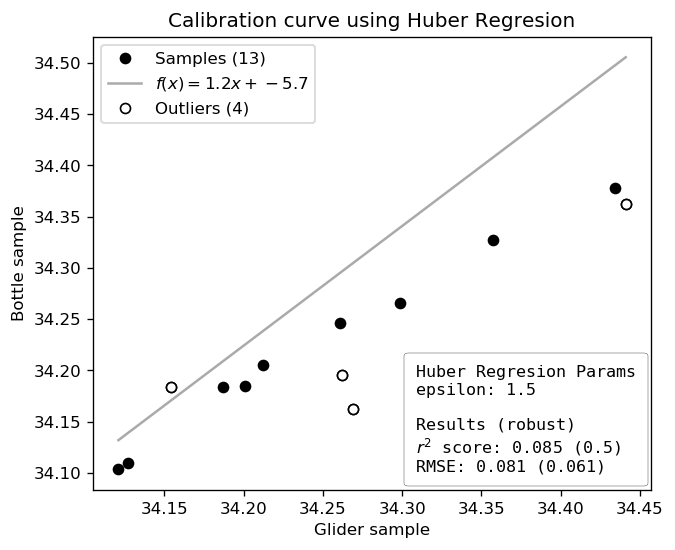
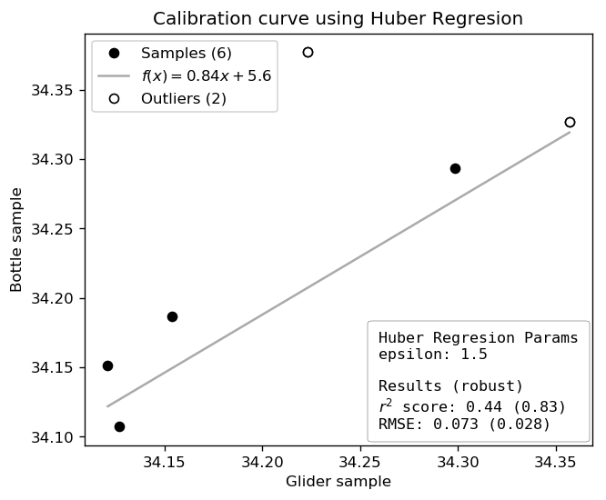

# Calibration with bottle samples

Bottle calibration can also be done using the `calibration` module.

The bottle file needs to be in a specific format with dates (`datetime64` format), depth and the variable values. This can be imported with any method available. I recommend `pandas.read_csv` as shown in the example below. Note that latitude and longitude are not taken into account, thus the user needs to make sure that the CTD cast was in the correct location (and time, but this will be used to match the glider).


```python
import pandas as pd

fname = '/Users/luke/Work/Publications/2019_Gregor_Front_glider/figures/SOSCEX 3 PS1.csv'
cal = pd.read_csv(fname, parse_dates=['datetime'], dayfirst=True)
```

The `calibration.bottle_matchup` function returns an array that matches the size of the ungridded glider data.
The matching is done based on depth and time from both the glider and the CTD. The function will show how many samples have been matched and the smallest time difference between a CTD rosette cast and a dive (any time on the dive).

### Using depth


```python
%autoreload 2

dat['bottle_sal'] = gt.calibration.bottle_matchup(
    dat.dives, dat.depth, dat.time,
    cal.depth, cal.datetime, cal.sal)

model = gt.calibration.robust_linear_fit(dat.salt_qc, dat.bottle_sal, fit_intercept=True, epsilon=1.5)
dat['salinity_qc'] = model.predict(dat.salt_qc)
```

    [stn 0/5]  FAILED: 2015-07-28 10:25 Couldn't find samples within constraints
    [stn 1/5]  FAILED: 2015-07-28 16:15 Couldn't find samples within constraints
    [stn 2/5]  FAILED: 2015-12-08 03:23 Couldn't find samples within constraints
    [stn 3/5] SUCCESS: 2016-01-05 17:46 (15 of 15 samples) match-up within 0.0 minutes
    [stn 4/5] SUCCESS: 2016-02-08 03:14 (12 of 17 samples) match-up within 0.0 minutes
    (13, 1) (100, 1)





### Using Density


```python
%autoreload 2

dat['bottle_sal'] = gt.calibration.bottle_matchup(
    dat.dives, dat.density, dat.time,
    cal.density, cal.datetime, cal.sal)

model = gt.calibration.robust_linear_fit(dat.salt_qc, dat.bottle_sal, fit_intercept=True, epsilon=1.5)
dat['salinity_qc'] = model.predict(dat.salt_qc)
```

    [stn 0/5]  FAILED: 2015-07-28 10:25 Couldn't find samples within constraints
    [stn 1/5]  FAILED: 2015-07-28 16:15 Couldn't find samples within constraints
    [stn 2/5]  FAILED: 2015-12-08 03:23 Couldn't find samples within constraints
    [stn 3/5] SUCCESS: 2016-01-05 17:46 (15 of 15 samples) match-up within 0.0 minutes
    [stn 4/5] SUCCESS: 2016-02-08 03:14 (16 of 17 samples) match-up within 0.0 minutes
    (6, 1) (100, 1)



