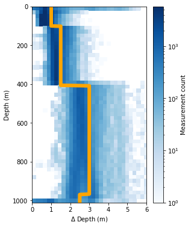
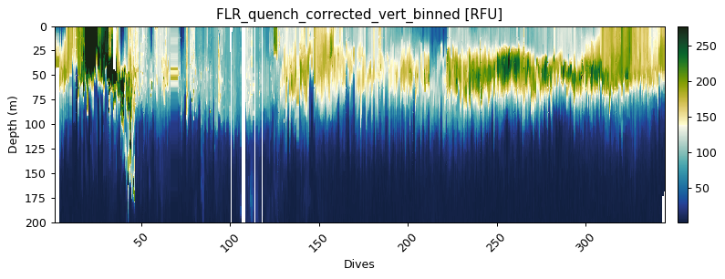
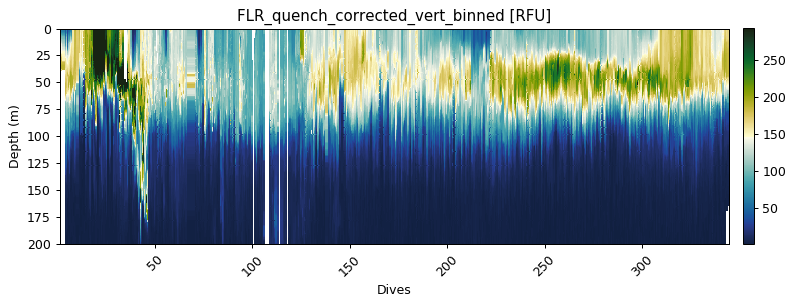
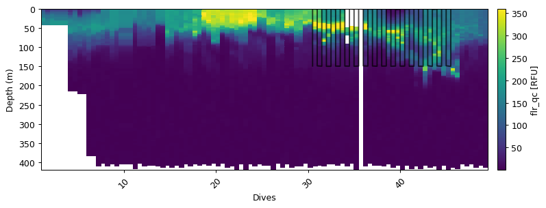
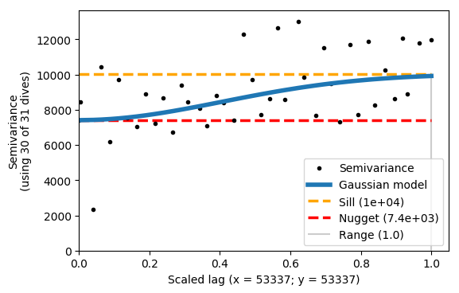
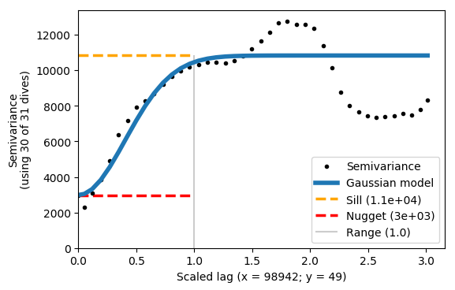
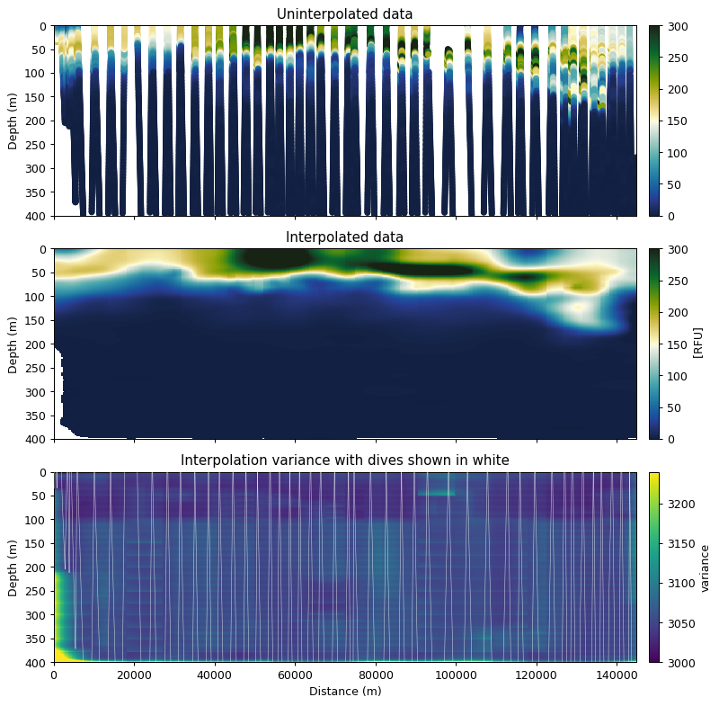

# Gridding and interpolation

## Vertical gridding
It is often more convenient and computationally efficient to work with data that has been gridded to a standard vertical grid (i.e. depths have been binned).
GliderTools offers very easy to use and efficient tools to grid data once all the processing has been completed.

The first task is to select the bin size of the data that will be gridded.
GliderTools automatically selects bin sizes according to the sampling frequency of the dataset for every 50m.
This is shown in the figure below, where the 2D histogram shows the sampling frequency (by depth) and the line shows the automatically selected bin size rounded up to the nearest 0.5m.


```python
ax = gt.plot.bin_size(dat.depth, cmap=mpl.cm.Blues)
ax.set_xlim(0, 6)
line = ax.get_children()[1]
line.set_linewidth(6)
line.set_color('orange')

legend = ax.get_children()[-2]
legend.set_visible(False)
```





### Gridding with automatic bin sizes

Gridding the data then becomes easy with automatic binning. But note that the x-coordinate has the be semi-discrete, e.g. dives number or dive time stamp average. You'll see that the gridding function also returns the mean bin size and then the average sampling frequency.

The function can return either an xr.DataArray or a pd.DataFrame. The DataArray is the default as metadata can be stored in these files (including coordinate information).

Gridded data can be passed to the plot function without x- and y-coordinates, as these are contained in the gridded data.

In fact, data is silently passed through the gridding function when x- and y-coordinates are included in the `gt.plot` function


```python
flr_gridded = gt.grid_data(dives, depth, flr)

ax = gt.plot(flr_gridded, cmap=cmo.delta)
ax.set_ylim(200, 0)
```

    Mean bin size = 1.99
    Mean depth binned (50 m) vertical sampling frequency = 2.53





### Gridding with manually defined bins

There is also the option to manuualy define your bins if you'd prefer.
A custom bin array needs to be created.
Use `np.arange` to create sections of the bins and combine them with `np.r_` as shown below:


```python
custom_bin = np.r_[
    np.arange(0, 100, 0.5),
    np.arange(100, 400, 1.0),
    np.arange(400, 1000, 2.0)]

flr_gridded = gt.grid_data(x, y, flr, bins=custom_bin)

# The plot below is the standard plotting procedure for an xarray.DataArray
gt.plot(flr_gridded, cmap=cmo.delta)
ylim(200, 0)
```

    Mean bin size = 1.25
    Mean depth binned (50 m) vertical sampling frequency = 2.53


    (200, 0)





## 2D interpolation with objective mapping (Kriging)

Users may want to interpolate data horizontally when working with finescale gradients.
Several studies have used the `objmap` MATLAB function that uses objective mapping (a.k.a. Kriging).
Kriging is an advanced form of inverse distance weighted interpolation, where points influence the interpolation based on the distance from an interpolation point, where the influence falls off with a Gauassian function.
This is an expensive function when the dataset is large (due to a matrix inverse operation).
The computational cost is reduced by breaking the problem into smaller pieces using a quadtree that iteratively breaks data into smaller problems.

GliderTools provides a Python implementation of the MATLAB function. We have added parallel capability to speed the processing up, but this operation is still costly and could take several hours if an entire section is interpolated. We thus recommend that smaller sections are interpolated.


```python
# first we select a subset of data (50k points)
subs = dat.isel(merged=slice(0, 50000))

# we then get time values - this makes creating the interpolation grid easier
var = subs.flr_qc
time = subs.time.values
depth = subs.depth
dives = subs.dives
dist = np.r_[0, gt.utils.distance(subs.longitude, subs.latitude).cumsum()]
```

### Part 1: Semivariance
Interpolating any variable requires some knowlege about the spatial autocorrelation of that variable. A semivariogram allows one to get this information from the data. The basic idea of a semivariogram is to assess the similarity between data at different lengthscales (lags), where a low semivariance shows coherence and a large semivariance shows a mismatch. This information is required to interpolate data with sensible estimates and error estimates.

GliderTools offers a derivation of a variogram tool (`gt.mapping.variogram`) that makes the process of finding these parameters a little easier, though there is a fair deal of subjectivity, depending on the scale of the question at hand, and tinkering are required to make a sensible interpolation.

#### 1.1. Choosing a subset of the data for semivariance estimation
The variogram function selects a number of dives (number depends on max_points) and performs the analysis on the subset of dives rathern than selecting random points. We thus recommend that a subset of the data is used to perform the analysis. In the example below, we take a subset of the data that as particularly high variability that we are interested in preserving. This subset is < 250m depth and limited to the first 20 dives. This should be tailored to the variable that you're interested in.


```python
m = (depth<150) & (dives > 30) & (dives < 46)
ax = gt.plot(dives, depth, var)
ax.plot(dives[m], depth[m], '-m', ms=3, alpha=0.7)
```


    [<matplotlib.lines.Line2D at 0x1c728526d8>]





#### 1.2. Initial estimate of semivariance
We can now find an initial estimate of the semivariance. This initial estimate will not scale the x/y coordinates for anisotropy (different scales of variability). The variogram function also accepts a boolean mask as an keyword argument. This will reduce the input data to the subset of data that you've chosen.

The example below shows this initial estimate. We're looking for an estimate where the Gaussian model fits the semi-variance as well as possible, given that the variance paramters are acceptable. These variance parameters are: *sill, nugget, x and y length-scales*. The function automatically adjusts the range to be one and scales the x and y parameters accordingly.

The variogram function can take time (datetime64), but we use distance (in metres) to demonstrate the the anisotropic scaling.


```python
vargram = gt.mapping.variogram(var, dist, depth, dives, mask=m)
```





The example above shows that x and y are scaled, but the Gaussian model does not fit the semivariance very well. The range is 1, because it is scaled accordingly. The sill and nugget are very similar - this is not a good result.

#### 1.3. Finding the correct x and y length scales (anisotropy)

We can now scale the data with the xy_ratio. The ratio represents the scaling of x/y. For example, if x and y are both in metres (as in this case), we need to set a small xy_ratio as x has a much longer lengthscale. With some trial and error we choose a ratio of 0.0005, which fits the semivariogram relatively well and has a reasonably low *y* scaling estimate.

You'll see that the Gaussian model does not fit the semivariance exactly - this is OK. The important thing is that the first plateau matches the sill.

We can now use these values for interpolating.


```python
vargram = gt.mapping.variogram(var, dist, depth, dives, mask=m, xy_ratio=0.0005)
```





### 2. Interpolation
#### 2.1 Preparing the interpolation grid
To perform the interpolation we first need to create the grid onto which data will be interpolated.
In the example below we use distance from the origin as the x-coordinate.
Time can also be used and has to be in a `np.datetime64` format - we show a commented example of this.
The y-coordinate is depth.


```python
# creating the x- and y-interpolation coordinates
# and a 1m vertical grid and a horizontal grid with 500 points
xi = np.linspace(dist.min(), dist.max(), 500)
yi = np.arange(0, depth[var.notnull()].max(), 1, dtype=float)

# time can also be used. This is a commented example of how to create
# a time grid for interpolation.
# xi = np.arange(time.min(), time.max(), 30, dtype='datetime64[m]')
```

#### 2.2 Interpolation with the semivariance parameters
The interpolation has a number of parameters that can be changed or adapted to the dataset at hand.
The commented inputs below describe these inputs.


```python
%autoreload 2

interpolated = gt.mapping.interp_obj(
    dist, depth, var, xi, yi,

    # Kriging interoplation arguments
    partial_sill=1.1e4,  # taken from the semivariogram (sill - nugget)
    nugget=3e3,  # taken from the semivariogram
    lenscale_x=98942,  # in hours if x and xi are in datetime64
    lenscale_y=50,  # the vertical gridding influence
    detrend=True,  # if True use linear regression (z - z_hat), if False use average (z - z_mean)

    # Quadtree arguments
    max_points_per_quad=65,  # an optimsation setting ~100 is good
    min_points_per_quad=8,  # if neighbours have < N points, look at their neighbours

    # Parallel calculation inputs.
    n_cpus=3,  # the number of CPU's to use for the calculation - default is n-1
    parallel_chunk_size=512,  # when the dataset is very large, memory can become an issue
                              # this prevents large buildup of parallel results
)
```

    Starting Interpolation with quadtree optimal interpolation
    ----------------------------------------------------------

    Preparing for interpolations:
    	Finding and removing nans
    	Removing data trend with linear regression
    	Building QuadTree

    Interpolation information:
    	basis points:        25226
    	interp grid:         500, 404
    	max_points_per_quad: 65
    	min_points_per_quad: 8
    	number of quads:     952
    	detrend_method:      linear_regression
    	partial_sill:        11000.0
    	nugget:              3000.0
    	lengthscales:        X = 98942
    	                     Y = 50 m

    Processing interpolation chunks in 2 parts over 3 CPUs:
    	chunk 1/2 completed in 12s
    	chunk 2/2 completed in 10s

    Finishing off interoplation
    	Adding back the trend
    	Creating xarray dataset for output


```python
fig, ax = plt.subplots(3, 1, figsize=[9, 9], sharex=True, dpi=90)

error_mask = (interpolated.variance / interpolated.nugget) < 1.05
interp_robust = interpolated.z.where(error_mask)

props = dict(vmin=0, vmax=300, cmap=cmo.delta)
gt.plot.scatter(dist, depth, var, ax=ax[0], **props)
gt.plot.pcolormesh(interp_robust, ax=ax[1], **props)
gt.plot.pcolormesh(interpolated.variance, ax=ax[2], vmin=interpolated.nugget, vmax=interpolated.nugget*1.08)

ax[2].plot(dist, depth, 'w-', zorder=40, alpha=0.8, lw=0.4)

[a.set_ylim(400, 0) for a in ax]
[a.set_xlabel('  ') for a in ax]

ax[0].get_children()[0].set_sizes([20])
ax[0].set_title('Uninterpolated data')
ax[1].set_title('Interpolated data')
ax[2].set_title('Interpolation variance with dives shown in white')
ax[2].set_xlabel('Distance (m)')

tks = xticks(rotation=0)
```



