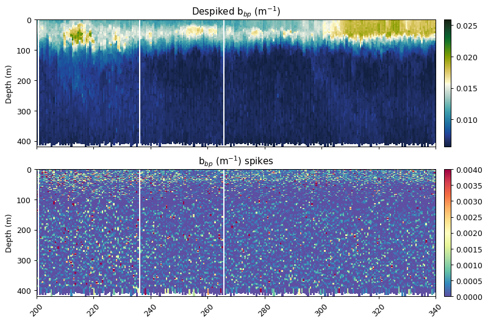
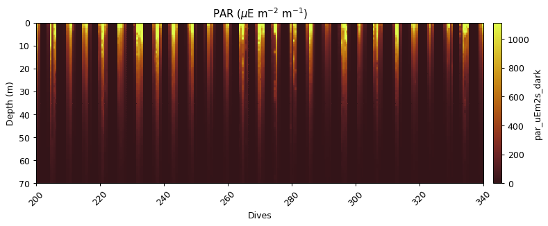

# Optics (BB, PAR, Chl)
The optics module contains functions that process backscatter, PAR and fluorescence.

There is a wrapper function for each of these variables that applies several functions related to cleaning and processing. We show each step of the wrapper function seperately and then summarise with the wrapper function.

## Backscatter


```python
theta = 124
xfactor = 1.076

gt.plot(x, y, bb700, cmap=cmo.delta, vmin=60, vmax=200)
xlim(200,340)
title('Original Data')
show()
```


### Outlier bounds method
See the cleaning section for more information on `gt.cleaning.outlider_bounds_[]`

```python
bb700_iqr = gt.cleaning.outlier_bounds_iqr(bb700, multiplier=3)
bb700_std = gt.cleaning.outlier_bounds_std(bb700, multiplier=3)

fig, ax = plt.subplots(2, 1, figsize=[9, 6], sharex=True, dpi=90)

gt.plot(x, y, bb700_iqr, cmap=cmo.delta, ax=ax[0], vmin=60, vmax=200)
gt.plot(x, y, bb700_std, cmap=cmo.delta, ax=ax[1], vmin=60, vmax=200)

[a.set_xlabel('') for a in ax]
[a.set_xlim(200, 340) for a in ax]

ax[0].set_title('Outlier IQR')
ax[1].set_title('Outlier STD')

plt.show()
```


### Removing bad profiles
This function masks bad dives based on mean + std x [1] or median + std x [1] at a reference depth.


```python
# find_bad_profiles returns boolean mask and dive numbers
# we index only the mask
bad_profiles = gt.optics.find_bad_profiles(dives, depth, bb700,
                                           ref_depth=300,
                                           stdev_multiplier=1,
                                           method='median')[0]

fig, ax = plt.subplots(2, 1, figsize=[9, 6], sharex=True, dpi=90)
# ~ reverses True to False and vice versa - i.e. we mask bad bad profiles
gt.plot(x, y, bb700, cmap=cmo.delta, ax=ax[0], vmin=60, vmax=200)
gt.plot(x, y, bb700.where(~bad_profiles), cmap=cmo.delta, ax=ax[1], vmin=60, vmax=200)

[a.set_xlabel('') for a in ax]
[a.set_xlim(40, 120) for a in ax]

ax[0].set_title('All backscatter data')
ax[1].set_title('Bad profiles masked')

plt.show()
```


### Conversion from counts to total backscatter

The scale and offset function uses the factory calibration dark count and scale factor.

The bback total function uses the coefficients from Zhang et al. (2009) to convert the raw counts into total backscatter (m-1), correcting for temperature and salinity. The $\chi$ factor and $\theta$ in this example were taken from Sullivan et al. (2013) and Slade & Boss (2015).


```python
beta = gt.flo_functions.flo_scale_and_offset(bb700.where(~bad_profiles), 49, 3.217e-5)
bbp = gt.flo_functions.flo_bback_total(beta, temp_qc, salt_qc, theta, 700, xfactor)

fig, ax = plt.subplots(2, 1, figsize=[9, 6], sharex=True, dpi=90)

gt.plot(x, y, beta, cmap=cmo.delta, ax=ax[0], robust=True)
gt.plot(x, y, bbp, cmap=cmo.delta, ax=ax[1], robust=True)

[a.set_xlabel('') for a in ax]
[a.set_xlim(200, 340) for a in ax]
[a.set_ylim(400, 0) for a in ax]

ax[0].set_title('$\u03B2$')
ax[1].set_title('b$_{bp}$ (m$^{-1}$)')

plt.show()
```


### Correcting for an in situ dark count
Sensor drift from factory calibration requires an additional correction, the calculation of a dark count in situ. This is calculated from the 95th percentile of backscatter measurements between 200 and 400m.


```python
bbp = gt.optics.backscatter_dark_count(bbp, depth)

gt.plot(x, y, bbp, cmap=cmo.delta, robust=True)
xlim(200,340)
title('b$_{bp}$ (m$^{-1}$)')
show()
```


### Despiking
Following the methods outlined in Briggs et al. (2011) to both identify spikes in backscatter and remove them from the baseline backscatter signal. The spikes are retained as the data can be used to address specific science questions, but their presence can decrease the accuracy of the fluorescence quenching function.


```python
bbp_horz = gt.cleaning.horizontal_diff_outliers(x, y, bbp, depth_threshold=10, mask_frac=0.05)
bbp_baseline, bbp_spikes = gt.cleaning.despike(bbp_horz, 7, spike_method='minmax')


fig, ax = plt.subplots(2, 1, figsize=[9, 6], sharex=True, dpi=90)

gt.plot(x, y, bbp_baseline, cmap=cmo.delta, ax=ax[0], robust=True)
gt.plot(x, y, bbp_spikes, ax=ax[1], cmap=cm.Spectral_r, vmin=0, vmax=0.004)

[a.set_xlabel('') for a in ax]
[a.set_xlim(200, 340) for a in ax]

ax[0].set_title('Despiked b$_{bp}$ (m$^{-1}$)')
ax[1].set_title('b$_{bp}$ (m$^{-1}$) spikes')

plt.show()
```





### Adding the corrected variables to the original dataframe


```python
dat['bbp700'] = bbp_baseline
dat['bbp700_spikes'] = bbp_spikes
```

### Wrapper function demonstration
A wrapper function was also designed, which is demonstrated below with the second wavelength (700 nm). The default option is for verbose to be True, which will provide an output of the different processing steps.


```python
bbp_baseline, bbp_spikes = gt.calc_backscatter(
    bb700, temp_qc, salt_qc, dives, depth, 700, 49, 3.217e-5,
    spike_window=11, spike_method='minmax', iqr=2., profiles_ref_depth=300,
    deep_multiplier=1, deep_method='median', verbose=True)

dat['bbp700'] = bbp_baseline
dat['bbp700_spikes'] = bbp_spikes

ax = gt.plot(x, y, dat.bbp700, cmap=cmo.delta),

[a.set_xlim(200, 340) for a in ax]

plt.show()
```


    ==================================================
    bb700:
    	Removing outliers with IQR * 2.0: 8606 obs
    	Mask bad profiles based on deep values (depth=300m)
    	Number of bad profiles = 27/672
    	Zhang et al. (2009) correction
    	Dark count correction
    	Spike identification (spike window=11)


```python
bbp_baseline, bbp_spikes = gt.calc_backscatter(
    bb470, temp_qc, salt_qc, dives, depth, 470, 47, 1.569e-5,
    spike_window=7, spike_method='minmax', iqr=3, profiles_ref_depth=300,
    deep_multiplier=1, deep_method='median', verbose=True)

dat['bbp470'] = bbp_baseline
dat['bbp470_spikes'] = bbp_spikes

gt.plot(x, y, dat.bbp470, cmap=cmo.delta)
plt.show()
```


    ==================================================
    bb470:
    	Removing outliers with IQR * 3: 2474 obs
    	Mask bad profiles based on deep values (depth=300m)
    	Number of bad profiles = 16/672
    	Zhang et al. (2009) correction
    	Dark count correction
    	Spike identification (spike window=7)


## PAR

### PAR Scaling

This function uses the factory calibration to convert from $\mu$V to $\mu$E m$^{-2}$ s$^{-1}$.


```python
par_scaled = gt.optics.par_scaling(par, 6.202e-4, 10.8)

fig, ax = plt.subplots(2, 1, figsize=[9, 6], sharex=True, dpi=90)

gt.plot(x, y, par, cmap=cmo.solar, ax=ax[0], robust=True)
gt.plot(x, y, par_scaled, cmap=cmo.solar, ax=ax[1], robust=True)

[a.set_xlabel('') for a in ax]
[a.set_xlim(200, 340) for a in ax]
[a.set_ylim(70, 0) for a in ax]

ax[0].set_title('PAR ($\mu$V)')
ax[1].set_title('PAR ($\mu$E m$^{-2}$ m$^{-1}$)')

plt.show()
```


### Correcting for an in situ dark count

Sensor drift from factory calibration requires an additional correction, the calculation of a dark count in situ. This is calculated from the median of PAR measurements, with additional masking applied for values before 23:01 and outside the 90th percentile.


```python
par_dark = gt.optics.par_dark_count(par_scaled, dives, depth, time)

gt.plot(x, y, par_dark, robust=True, cmap=cmo.solar)
xlim(200,340)
ylim(70,0)
title('PAR ($\mu$E m$^{-2}$ m$^{-1}$)')
show()
```





### PAR replacement

This function removes the top 5 metres from each dive profile, and then algebraically recalculates the surface PAR using an exponential equation.


```python
par_filled = gt.optics.par_fill_surface(par_dark, dives, depth, max_curve_depth=80)
par_filled[par_filled < 0] = 0
par_filled = par_filled.fillna(0)
```


```python
i = dives == 232

fig, ax = subplots(1, 2, figsize=[6,6], dpi=100)

ax[0].plot(par_dark[i], depth[i], lw=0.5, marker='o', ms=5)
ax[0].plot(par_filled[i], depth[i], lw=0.5, marker='o', ms=3)
ax[1].plot(par_filled[i] - par_dark[i], depth[i], lw=0, marker='o')

ax[0].set_ylim(80,0)
ax[0].set_ylabel('Depth (m)')
ax[0].set_xlabel('PAR ($\mu$E m$^{-2}$ m$^{-1}$)')

ax[1].set_ylim(80,0)
ax[1].set_xlim(-350,350)
ax[1].set_yticklabels('')
ax[1].set_xlabel('Difference between profiles')

fig.tight_layout()
plt.show()
```


```python
gt.plot(x, y, par_filled, robust=True, cmap=cmo.solar)
xlim(200,340)
ylim(100,0)
title('PAR ($\mu$E m$^{-2}$ m$^{-1}$)')
show()
```


### Wrapper function demonstration


```python
par_qc = gt.calc_par(par, dives, depth, time,
                     6.202e-4, 10.8,
                     curve_max_depth=80,
                     verbose=True).fillna(0)

gt.plot(x, y, par_qc, robust=True, cmap=cmo.solar)
ylim(80, 0)
show()
```


    ==================================================
    PAR
    	Dark correction
    	Fitting exponential curve to data


### Deriving additional variables

#### Euphotic Depth and Light attenuation coefficient


```python
euphotic_depth, kd = gt.optics.photic_depth(
    par_filled, dives, depth,
    return_mask=False,
    ref_percentage=1
)
```


```python
fig, ax = subplots(1, 1, figsize=[6,4], dpi=100)
p1 = plot(euphotic_depth.index, euphotic_depth, label='Euphotic Depth')
ylim(120,0)
ylabel('Euphotic Depth (m)')
xlabel('Dives')
ax2 = ax.twinx()
p2 = plot(kd.index, kd, color='orange', lw=0, marker='o', ms=2, label='K$_d$')
ylabel('K$_d$', rotation=270, labelpad=20)

lns = p1+p2
labs = [l.get_label() for l in lns]
ax2.legend(lns, labs, loc=3, numpoints=1)

show()
```


## Fluorescence

Quenching Correcting Method as outlined in Thomalla et al. (2017)


```python
gt.plot(x, y, fluor, cmap=cmo.delta, robust=True)
xlim(150,300)
title('Original Data')
show()
```


### Outlier bounds method


```python
flr_iqr = gt.cleaning.outlier_bounds_iqr(fluor, multiplier=3)

gt.plot(x, y, flr_iqr, cmap=cmo.delta, robust=True)
title('Outlier Bounds IQR Method')
xlim(150,300)
show()
```


### Removing bad profiles

This function masks bad dives based on mean + std x [3] or median + std x [3] at a reference depth.


```python
bad_profiles = gt.optics.find_bad_profiles(dives, depth, flr_iqr,
                                           ref_depth=300,
                                           stdev_multiplier=4,
                                           method='mean')
flr_goodprof = flr_iqr.where(~bad_profiles[0])

fig, ax = plt.subplots(2, 1, figsize=[9, 6], sharex=True, dpi=90)

gt.plot(x, y, flr_iqr, cmap=cmo.delta, ax=ax[0], robust=True)
gt.plot(x, y, flr_goodprof, cmap=cmo.delta, ax=ax[1], robust=True)

[a.set_xlabel('') for a in ax]
[a.set_xlim(90, 150) for a in ax]
[a.set_ylim(300, 0) for a in ax]

ax[0].set_title('Bad Profiles Included')
ax[1].set_title('Bad Profiles Discarded')

plt.show()
```


### Correcting for an in situ dark count

Sensor drift from factory calibration requires an additional correction, the calculation of a dark count in situ. This is calculated from the 95th percentile of fluorescence measurements between 300 and 400m.


```python
flr_dark = gt.optics.fluorescence_dark_count(flr_iqr, dat.depth)

gt.plot(x, y, flr_dark, cmap=cmo.delta, robust=True)
xlim(150,300)
show()
```


### Despiking


```python
flr_base, flr_spikes = gt.cleaning.despike(flr_dark, 11, spike_method='median')

fig, ax = plt.subplots(2, 1, figsize=[9, 6], sharex=True, dpi=90)

gt.plot(x, y, flr_base, cmap=cmo.delta, ax=ax[0], robust=True)
gt.plot(x, y, flr_spikes, cmap=cm.RdBu_r, ax=ax[1], vmin=-5, vmax=5)

[a.set_xlabel('') for a in ax]
[a.set_xlim(150, 300) for a in ax]
[a.set_ylim(300, 0) for a in ax]

ax[0].set_title('Despiked Fluorescence')
ax[1].set_title('Fluorescence spikes')

plt.show()
```


### Quenching Correction

This function uses the method outlined in Thomalla et al. (2017), briefly it calculates the quenching depth and performs the quenching correction based on the fluorescence to backscatter ratio. The quenching depth is calculated based upon the different between night and daytime fluorescence.

The default setting is for the preceding night to be used to correct the following day's quenching (`night_day_group=True`). This can be changed so that the following night is used to correct the preceding day. The quenching depth is then found from the difference between the night and daytime fluorescence, using the steepest gradient of the {5 minimum differences and the points the difference changes sign (+ve/-ve)}.

The function gets the backscatter/fluorescence ratio between from the quenching depth to the surface, and then calculates a mean nighttime ratio for each night. The quenching ratio is calculated from the nighttime ratio and the daytime ratio, which is then applied to fluorescence to correct for quenching. If the corrected value is less than raw, then the function will return the original raw data.


```python
flr_qc, quench_layer = gt.optics.quenching_correction(
    flr_base, dat.bbp470, dives, depth, time, lats, lons,
    sunrise_sunset_offset=1, night_day_group=True)

fig, ax = plt.subplots(2, 1, figsize=[9, 6], sharex=True, dpi=90)

gt.plot(x, y, flr_qc, cmap=cmo.delta, ax=ax[0], robust=True)
gt.plot(x, y, quench_layer, cmap=cm.RdBu_r, ax=ax[1], vmin=-.5, vmax=2)

[a.set_xlabel('') for a in ax]
[a.set_xlim(150, 300) for a in ax]
[a.set_ylim(100, 0) for a in ax]

ax[0].set_title('Quenching Corrected Fluorescence')
ax[1].set_title('Quenching Layer')

plt.show()
```


### Wrapper function


```python
flr_qnch, flr, qnch_layer, [fig1, fig2] = gt.calc_fluorescence(
    fluor, dat.bbp700, dives, depth, time, lats, lons, 53, 0.0121,
    profiles_ref_depth=300, deep_method='mean', deep_multiplier=1,
    spike_window=11, spike_method='median', return_figure=True,
    night_day_group=False, sunrise_sunset_offset=2, verbose=True)

dat['flr_qc'] = flr
```


    ==================================================
    Fluorescence
    	Mask bad profiles based on deep values (ref depth=300m)
    	Number of bad profiles = 19/672
    	Dark count correction
    	Quenching correction
    	Spike identification (spike window=11)
    	Generating figures for despiking and quenching report


