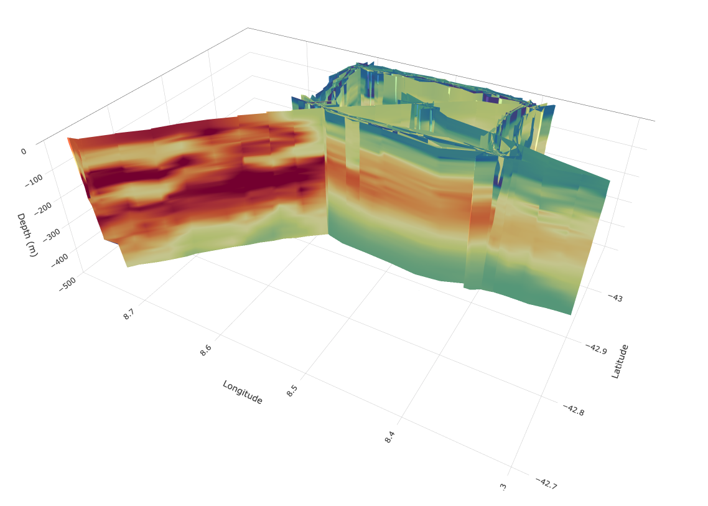

# Other tools and utilities

## 3D interactive plot

This is purely for investigative purposes, but provides a good way to interact with the data.


```python
plotly_figure = gt.plot.section3D(
    dat.dives, dat.depth, dat.longitude, dat.latitude, dat.salt_qc,
    zmin=-500, vmax=.999, vmin=.005
)
```

