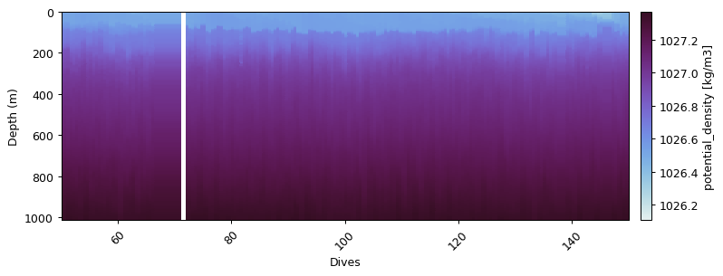
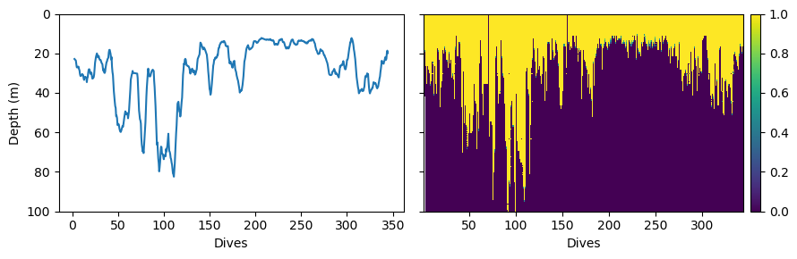

# Secondary physical variables

## Density
GliderTools provides a wrapper to calculate potential density.
This is done by first calculating potential temperature and then calculating absolute salinity.
A reference depth of `0` is used by default


```python
dens0 = gt.physics.potential_density(salt_qc, temp_qc, pres, lats, lons)
dat['density'] = dens0
gt.plot(dat.dives, dat.depth, dens0, cmap=cmo.dense)
plt.xlim(50,150)
plt.show()
```





## Mixed Layer Depth


```python
mld = gt.physics.mixed_layer_depth(dives, depth, dens0)
mld_smoothed = mld.rolling(10, min_periods=3).mean()

mld_mask = gt.physics.mixed_layer_depth(dives, depth, dens0, return_as_mask=True)
mld_grid = gt.grid_data(x, y, mld_mask, verbose=False)

fig, ax = plt.subplots(1, 2, figsize=[9, 3], dpi=100, sharey=True)

mld_smoothed.plot(ax=ax[0])
gt.plot(mld_grid, ax=ax[1])

[a.set_ylim(100, 0) for a in ax]

ax[0].set_ylabel('Depth (m)')
[a.set_xlabel('Dives') for a in ax]
xticks(rotation=0)

fig.tight_layout()
```

    /Users/luke/Git/GliderTools/glidertools/helpers.py:61: GliderToolsWarning:

    Primary input variable is not xr.DataArray data type - no metadata to pass on.



