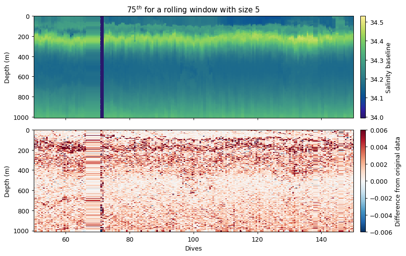

# Quality Control
Note that this summary carries on from the _Loading data_ page.

The `cleaning` module contains several tools that help to remove erroneous data - profiles or points.
These filters can be applied *globally* (IQR and standard devation limits), *vertically* (running average filters) or *horizontally* (horizontal filters on gridded data only).

There are also two approaches one can use to clean data: 1) filtering out bad points/dives; 2) smoothing data.


## Original Data

Below we use **salinity** to demonstrate the different functions available to users.

```python
dives = dat.dives
depth = dat.depth
salt = dat.salinity_raw

x = np.array(dives)  # ensures these are arrays
y = np.array(depth)

gt.plot(dives, depth, salt, cmap=cmo.haline, robust=True)
plt.xlim(50, 150)
plt.title('Original Data')
plt.show()
```


## Global filtering: outlier limits (IQR & STD)
These functions find upper and lower limits for data outliers using interquartile range and standard deviations of the entire dataset. Multipliers can be set to make the filters more or less strict


```python
salt_iqr = gt.cleaning.outlier_bounds_iqr(salt, multiplier=1.5)
salt_std = gt.cleaning.outlier_bounds_std(salt, multiplier=1.5)

# Plotting
gt.plot(x, y, salt_iqr, cmap=cmo.haline, robust=True)
plt.title('Outlier Bounds IQR Method')
plt.xlim(50,150)

gt.plot(x, y, salt_std, cmap=cmo.haline, robust=True)
plt.title('Outlier Bounds Stdev Method')
plt.xlim(50,150)

plt.show()
```


## Horizontal filtering: differential outliers
Erroneous measurements often occur sequentially - i.e. in the vertical. The vertical filtering approaches would thus miss any outliers as rolling windows are often used. It is thus useful to have an approach that compares dives in the horizontal. The `horizontal_diff_outliers` first grids data and then calculates where gradients (rolling mean - measurement) are outliers (same as `outlier_bounds_std`). If a certain fraction of measurements in a dive exceed the threshold, then that dive is deemed a bad dive. The example below shows three dives that have anomalous measurements.  These fall well within the global bounds of acceptable data, but horizontally that are masked out.


```python
salt_horz = gt.cleaning.horizontal_diff_outliers(
    x, y, salt,
    multiplier=3,
    depth_threshold=400,
    mask_frac=0.1
)

gt.plot(x, y, salt, cmap=cmo.haline)
plt.title('Original dataset')
plt.xlim(150,250)
plt.show()

gt.plot(x, y, salt_horz, cmap=cmo.haline)
plt.title('Horizontal Differential Outliers removed')
plt.xlim(150,250)
plt.show()
```


## Vertical smoothing approaches

### Despiking
This approach was used by Briggs et al. (2010). The idea is to apply a rolling filter to the data (along the time dimension). This forms the baseline. The difference from the original data are spikes.

There are two rolling filters that can be applied to the data. The *median* approach is the equivalent of a rolling median. The *minmax* approach first applies a rolling minimum and then rolling maximum to data. This is useful particularly for optics data where spikes are particles in the water column and are not normally distributed.

In the case of salinity, the *median* approach is likely best, as "spikes" would be positive and negative (Gaussian distribution).


```python
salt_base, salt_spike = gt.cleaning.despike(salt, window_size=5, spike_method='median')

fig, ax = plt.subplots(2, 1, figsize=[9, 6], sharex=True, dpi=90)

gt.plot(x, y, salt_base, cmap=cmo.haline, ax=ax[0])
ax[0].set_title('Despiked using median filter')
ax[0].cb.set_label('Salinity baseline')
ax[0].set_xlim(50,150)
ax[0].set_xlabel('')

gt.plot(x, y, salt_spike, cmap=cm.RdBu_r, vmin=-6e-3, vmax=6e-3, ax=ax[1])
ax[1].cb.set_label('Salinity spikes')
ax[1].set_xlim(50,150)

plt.xticks(rotation=0)
plt.show()
```


### Rolling window

The rolling window method simply applies an aggregating function (`mean, median, std, min, max`) to the dataset.
Because the above example is equivalent to a rolling median, we show what a rolling `75th percentile` looks like instead.

This could be used to create additional filters by users. Note that in this more complex example we create a wrapper function for the percentile so that we can tell the percentile function that we want the 75th percentile and we want to calculate this along the nth axis.


```python
def seventyfith(x, axis=0):
    # wrapper function so we can pass axis and percentile to
    # the input function
    return np.percentile(x, 75, axis=axis)

# other numpy functions also work: np.mean, np.median, np.std
salt_roll75 = gt.cleaning.rolling_window(salt, seventyfith, window=5)
salt_rollavg = gt.cleaning.rolling_window(salt, mean, window=5)

# PLOTTING
fig, ax = plt.subplots(2, 1, figsize=[9, 6], sharex=True, dpi=90)

gt.plot(x, y, salt_roll75, cmap=cmo.haline, ax=ax[0])
ax[0].set_title('75$^{th}$ for a rolling window with size 5')
ax[0].cb.set_label('Salinity baseline')
ax[0].set_xlim(50,150)
ax[0].set_xlabel('')

gt.plot(x, y, salt_roll75 - salt, cmap=cm.RdBu_r, vmin=-6e-3, vmax=6e-3, ax=ax[1])
ax[1].cb.set_label('Difference from original data')
ax[1].set_xlim(50,150)

plt.xticks(rotation=0)
plt.show()
```



### Savitzky-Golay
The Savitzky-Golay function fits a low order polynomial to a rolling window of the time series. This has the result of smoothing the data. A larger window with a lower order polynomial with have a smoother fit.

We recommend a 2nd order kernel. Here we use first order to show that the difference can be quite big.


```python
salt_savgol = gt.cleaning.savitzky_golay(salt, window_size=11, order=1)

# PLOTTING
fig, ax = plt.subplots(2, 1, figsize=[9, 6], sharex=True, dpi=90)

gt.plot(x, y, salt_savgol, cmap=cmo.haline, ax=ax[0])
ax[0].set_title('Smoothing the data with Savitzky-Golay')
ax[0].cb.set_label('Smoothed salinity')
ax[0].set_xlim(50,150)
ax[0].set_xlabel('')

gt.plot(x, y, salt_savgol - salt, cmap=cm.RdBu, vmin=-6e-3, vmax=6e-3, ax=ax[1])
ax[1].cb.set_label('Difference from original')
ax[1].set_xlim(50,150)

plt.show()
```


## Wrapper functions

Wrapper functions have been designed to make this process more efficient, which is demonstrated below with **temperature** and **salinity**.


```python
temp_qc = gt.calc_physics(temp, x, y,
                          iqr=1.5, depth_threshold=0,
                          spike_window=5, spike_method='median',
                          savitzky_golay_window=11, savitzky_golay_order=2)

# PLOTTING
fig, ax = plt.subplots(3, 1, figsize=[9, 8.5], sharex=True, dpi=90)

gt.plot(x, y, temp, cmap=cmo.thermal, ax=ax[0])
gt.plot(x, y, temp_qc, cmap=cmo.thermal, ax=ax[1])
gt.plot(x, y, temp_qc - temp, cmap=cm.RdBu_r, vmin=-0.05, vmax=0.05, ax=ax[2])

[a.set_xlabel('') for a in ax]

ax[0].cb.set_label('Original Data')
ax[1].cb.set_label('Cleaned Data')
ax[2].cb.set_label('Difference from Original')

plt.show()
```


    ==================================================
    Physics Variable:
        Removing outliers with IQR * 1.5: 0 obs
        Removing spikes with rolling median (spike window=5)
        Smoothing with Savitzky-Golay filter (window=11, order=2)


```python
salt_qc = gt.calc_physics(salt, x, y,
                          mask_frac=0.2, iqr=2.5,
                          spike_window=5, spike_method='median',
                          savitzky_golay_window=11, savitzky_golay_order=2)

# PLOTTING
fig, ax = plt.subplots(3, 1, figsize=[9, 8.5], sharex=True, dpi=90)

gt.plot(x, y, salt, cmap=cmo.haline, ax=ax[0])
gt.plot(x, y, salt_qc, cmap=cmo.haline, ax=ax[1])
gt.plot(x, y, salt_qc - salt, cmap=cm.RdBu_r, vmin=-0.02, vmax=0.02, ax=ax[2])

[a.set_xlabel('') for a in ax]

ax[0].cb.set_label('Original Data')
ax[1].cb.set_label('Cleaned Data')
ax[2].cb.set_label('Difference from Original')

plt.show()
```


    ==================================================
    Physics Variable:
        Removing outliers with IQR * 2.5: 1551 obs
        Removing spikes with rolling median (spike window=5)
        Removing horizontal outliers (fraction=0.2, multiplier=2.5)
        Smoothing with Savitzky-Golay filter (window=11, order=2)


```python
dat['temp_qc'] = temp
dat['salt_qc'] = salt
```
